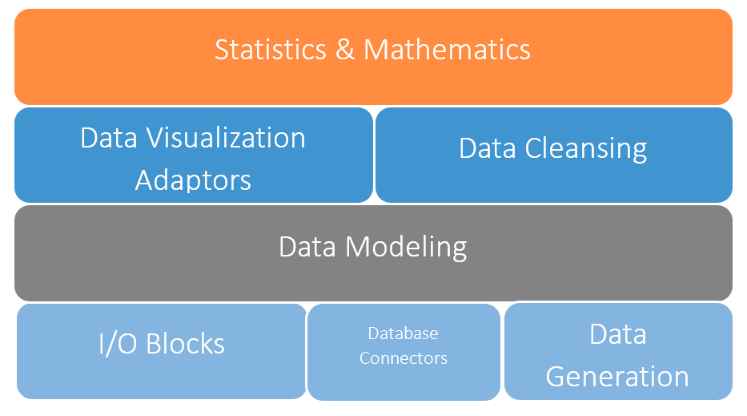

# Squirrel
**Cross-Platform Agile Data Analytics for .NET**

[](https://www.nuget.org/packages/TableAPI/)
[](https://www.nuget.org/packages/TableAPI/)
[](https://docs.microsoft.com/en-us/dotnet/standard/net-standard)
[](LICENSE)

[](https://github.com/sudipto80/Squirrel/issues)
[](https://github.com/sudipto80/Squirrel/commits/main)
[](https://github.com/sudipto80/Squirrel/graphs/commit-activity)
[](docs/index.md)


[`Squirrel LOGO is designed by Pirog tetyana from The Noun Project`](https://raw.github.com/sudipto80/Squirrel/newb/img/license.txt)

Squirrel is a comprehensive data processing and analytics framework designed specifically for .NET developers. It transforms messy data into insights through an intuitive, business-readable API that makes data cleaning, analysis, and visualization accessible to both developers and business users.


Squirrel is built on .NET Standard 2.0

## ⚡ Quick Start

```csharp
using Squirrel;

// Load, clean, and analyze data in a readable pipeline
var insights = DataAcquisition.LoadCsv("sales_data.csv")
    .RemoveOutliers("amount")
    .NormalizeColumn("customer_name", NormalizationStrategy.NameCase)
    .RemoveNonMatches("email", @"^[^@]+@[^@]+\.[^@]+$")
    .SortBy("amount");

insights.PrettyDump();
```

## 🎯 Why Squirrel?

Data Analytics and Big Data are now the buzz words of the industry. Today many businesses want to drive their businesses using Data Analytics – by gaining insights from their data. Aesthetically pleasing data visualizations with agility are key for effective discovery of insights. And better insight requires a bunch of special skills – an expertise in the field of [Data Science](http://en.wikipedia.org/wiki/Data_science). But are Data Scientists easy to come by?

Most of the datasets used by businesses are not anywhere near Big. Actually they are Tiny to Medium. A typical dataset has only few thousand rows! Professor [Alex Smola](https://www.linkedin.com/in/smola) has named datasets based on their sizes as follows:

| Dataset Size | Name |
|:-------------|:-----|
| Dataset that can fit in your mobile phone | Tiny |
| Dataset that can fit in your laptop (1GB) | Small |
| Dataset that can fit in your workstation (4 GB) | Medium |
| Dataset that can fit in your server | Large |
| When clusters of your servers struggle | Big |

Businesses are so sold up to the idea of Big data (it has almost become a status symbol) that they ignore the power of small data tools developed in-house in deriving their insights. So could software developers replace the need of the Data Scientist in answering most questions that involve Tiny or Medium datasets?

**The .NET Data Gap**: While Python has pandas and R has comprehensive data tools, .NET developers have lacked a mature, integrated solution for data processing. Squirrel fills this gap with:

- **Business-Readable Code**: Pipelines read like specifications, not technical implementation
- **Complete Data Platform**: Generate, clean, analyze, and visualize data in one framework
- **Mathematical Modeling**: Create datasets from formulas and scientific calculations
- **Performance Optimized**: Processes 100k rows in under 1 second
- **Enterprise Ready**: Built-in compliance features (GDPR, HIPAA) and data masking capabilities

**Squirrel** brings the application closer to the Business user by delivering the ability to acquire and visualize data from a variety of sources to their personal devices. We envision smart abilities in Squirrel that would bring agile data analytic solution development and delivery to near real time.

## 📊 Core Capabilities

### Data Generation & Mathematical Modeling
Create datasets from mathematical formulas and scientific calculations:
```csharp
// Generate time series data for physics simulation
var model = new Table();
model.AddColumn("Time", Enumerable.Range(1, 60).Select(x => x.ToString()).ToList());
model.AddColumn("X", "Sqrt(9.81*0.25/68.1)*[Time]", 4);
model.AddColumn("Speed", @"Sqrt (9.81*68.1/0.25) * (Exp([X])-Exp(-[X]))/(Exp([X])+Exp(-[X]))", 5);

// Visualize the mathematical model
var chart = model.Pick("Time", "Speed")
    .ToBarChartByGoogleDataVisualization("Time", "Speed at a given time", 
                                        "Speed of bungee jumper");
```

### Data Acquisition
Load and save data from/to multiple sources/destinations.
```csharp
var data = DataAcquisition.LoadCsv("file.csv");
var table = DataAcquisition.LoadHtml(tableHtml);
var data = DataAcquisition.LoadParquet("file.parquet");
var data = DataAcquisition.LoadCsv("file.csv");
tab.ToCsv("logs.csv");
// Reading from anonymous type list
var fromMemory = Enumerable.Range(1,10).Select( n => new { Name = $"Name {n}", Data = n })
                                       .ToTableFromAnonList();

```

### Data Cleaning & Validation
Comprehensive cleaning functions with natural language naming:
```csharp
cleanData = messyData
    .RemoveIfNotBetween("age", 18, 120)
    .RemoveNonMatches("email", emailRegex)
    .NormalizeColumn("name", NormalizationStrategy.NameCase)
    .RemoveIncompleteRows();
```

### Statistical Analysis
Built-in statistical functions and aggregations:
```csharp
var outliers = data.ExtractOutliers("revenue");
// data is a table instance 
var summary = data.Gist();
```

### Data Visualization
Ready-made connectors to popular visualization libraries:
```csharp
data.ToBarChartByGoogleDataVisualization( "revenue", "region", "revenue per region");
```

## 🏗️ Architecture



Squirrel follows a layered architecture enabling complete data workflows:
- **Data Generation Layer**: Mathematical formulas and calculated columns
- **Data Acquisition Layer**: Multiple format and source support  
- **Processing Engine**: Immutable operations with method chaining
- **Analysis Layer**: Statistical functions and business intelligence
- **Visualization Layer**: Integration with industry-standard charting libraries

Data analytics solution development using **Squirrel** follows a templatized design style. As a Data Scientist would, a software developer using Squirrel too would solve a data analytics problem by stacking his solution starting with Data acquisition, followed by Data modeling & cleansing and then topping up with appropriate Data visualization. Applying Bootstrap to the visualization is automatic, bringing agility to development without compromising on quality of user experience.

## 🔧 Key Design Philosophy

Here are couple of design decisions that have been the guiding principle for the choice of internal data structure for Squirrel `Table` data structure to make data accessing/manipulating more intuitive and efficient at the same time:

* Each row in the table should be available by zero based integer indexing as we do in arrays and `List<T>`. So if a table `birthRates` exists then we should be able to get to 10th row by the syntax `birthRates[9]`
* A column at a given index should be available by the column name index. So if we have a table `StockValues` that stores average stock values in a year of different companies where the row depicts the year and the column depicts the company for which the stock price is stored, then we should be able to get the stock price for Microsoft (Symbol "MSFT") for 5th year as `StockValues[4]["MSFT"]`
* Value at row "k" (Expressed as an integer) and column "m" (Expressed as a string) has to be accessible by either of the syntax `table[k]["m"]` or `table["m"][k]`.


## 🚀 Installation

### NuGet Package Manager
```
Install-Package TableAPI
```

### .NET CLI
```
dotnet add package TableAPI
```

### Package Manager UI
Search for "TableAPI" in Visual Studio's Package Manager

Although the package is named `TableAPI` the namespaces to import is Squirrel like:

```csharp
using Squirrel;
``` 

and in F#:

```fsharp 
open Squirrel
open Squirrel.FSharp
```

## 💡 Real-World Examples

### Customer Data Cleaning Pipeline
```csharp
var cleanCustomers = messyCustomerData
    .NormalizeColumn("name", NormalizationStrategy.NameCase)
    .RemoveNonMatches("email", @"^[^@]+@[^@]+\.[^@]+$")
    .Transform("phone", phone => FormatPhoneNumber(phone))
    .RemoveIfNotBetween("registration_date", startDate, endDate)
    .MaskColumn("ssn", MaskingStrategy.StarExceptLastFour);
```

### Financial Analytics
```csharp
var analysis = transactionData
    .RemoveOutliers("amount")
    .SortBy("amount")
    .ToBarChartByGoogleDataVisualization ("amount", "Amounts", "Sales Amounts");
```

## 📋 API Overview

1. **`BasicStatistics`** - Basic statistical functions like Median, Range, Standard Deviation, Kurtosis, etc.
2. **`CustomComparers`** - Several customized comparators for sorting data.
3. **`DataAcquisition`** - Data loaded/dumped from/to various formats, e.g. CSV, TSV, HTML, ARFF, etc.
4. **`DatabaseConnectors`** - Data can be loaded from popular DB repositories by using the connectors for SQL Server and MongoDB.
5. **`DataCleansers`** - Extraction/Removal of outliers or data that matches specific boolean criteria.
6. **`OrderedTable`** - A data structure to hold sort results temporarily.
7. **`Table`** - An ubiquitous data structure used to encapsulate the data. Several APIs are part of the *Table* -
   * Filter data using regular expressions or SQL clause.
   * Sort data based on columns and their values.
   * Programmatic manipulation i.e. deletion, updation and insertion of data.
   * Merge data columns; Find subsets and exclusive or common rows in tables.
   * Other utilities to split or drop data columns; Find rows that meet a specific statistical criteria, e.g. top 10, below average, etc.
   * Natural queries

## 🏢 Enterprise Features

- **Data Masking & Privacy**: GDPR and HIPAA compliant data anonymization
- **Business Rule Validation**: Enforce complex data quality rules
- **Performance Optimization**: Efficient processing of medium-scale datasets (10k-1M rows)
- **Audit Trail**: Immutable operations maintain data lineage
- **Integration Ready**: Works with existing .NET enterprise applications

## 🎬 Squirrel in Action (Under 5 minutes)
[See it in action](https://youtu.be/jv1znNEq5h4)

## 🧪 Unit Tests

To run unit tests. Use the following .NET CLI command:

```batch
dotnet test SquirrelTests/
``` 

## 📋 Dependency

There is a dependency for [NCalc2](https://github.com/sklose/NCalc2) for the following methods:
```csharp
AddColumn() 
AddRows()
AddRowsByShortHand()
``` 

## 🤝 Contributing

We welcome contributions! Squirrel is actively developed and early adopters can shape its evolution.

### Ways to Contribute
- Report bugs and request features via Issues
- Submit pull requests for improvements
- Add examples and documentation
- Share your use cases and success stories

### Development Setup
```bash
git clone https://github.com/sudipto80/Squirrel.git
cd Squirrel
dotnet restore
dotnet test SquirrelTests/
```

## 📚 Documentation & Learning

- **[API Documentation](doc/TableAPI.chm)** - Comprehensive method reference
- **[Examples Gallery](ScreenCastDemos/)** - Real-world use cases and tutorials
- **[Video Tutorial](https://youtu.be/jv1znNEq5h4)** - 5-minute introduction
- **[CheatSheet](http://www.slideshare.net/sudipto80/squirrel-do-morewithlesscodelightcheatsheet)** - Quick reference guide
- **[High-level Function List](https://github.com/sudipto80/Squirrel/blob/master/Documentations/Documentation.md)** - Functions and their summaries

The documentation will be perpetually in-progress as the development is very active right now. Also this is a place where you can contribute. If you are looking for example, take a look at the documentation for [Aggregate](https://github.com/sudipto80/Squirrel/blob/master/Documentations/Aggregate.md).

## 📊 Usage Stats & Community

- **8,100+ NuGet Downloads**: Growing adoption across .NET teams 
- **Enterprise Validation**: Used in algorithmic trading and financial analytics
- **Active Development**: Regular updates and community-driven features

## 🛠️ First 50 Examples (Work in Progress)

1. [Do women pay more tip than men?](https://github.com/sudipto80/Squirrel/blob/master/ScreenCastDemos/example-01.md)
2. [Iris dataset aggregation](https://github.com/sudipto80/Squirrel/blob/master/ScreenCastDemos/example-02.md)
3. [Finding Gender-Ratio statistics in North America](https://github.com/sudipto80/Squirrel/blob/master/ScreenCastDemos/example-03.md)
4. [Finding top gold winning nations in Olympics](https://github.com/sudipto80/Squirrel/blob/master/ScreenCastDemos/example-04.md)
5. [How much money someone will accumulate at retirement](https://github.com/sudipto80/Squirrel/blob/master/ScreenCastDemos/example-05.md)
6. [Titanic Survivor Analysis per class](https://github.com/sudipto80/Squirrel/blob/master/ScreenCastDemos/example-06.md)
7. [Calculating speed of a bungee jumper](https://github.com/sudipto80/Squirrel/blob/master/ScreenCastDemos/example-07.md)
8. [Finding most popular baby names in centuries](https://github.com/sudipto80/Squirrel/blob/master/ScreenCastDemos/example-08.md)
9. [Stock Price Analysis](https://github.com/sudipto80/Squirrel/blob/master/example-09.md)
10. More examples coming very soon... 

## 🛣️ Roadmap

- Enhanced machine learning integration
- Real-time data processing capabilities  
- Advanced visualization templates
- Cloud-native deployment options
- Performance optimizations for large datasets

## 💼 Commercial Support

Squirrel is open source and free to use. For enterprise support, training, or custom development:
- Create an issue for community support
- Check the documentation for common solutions
- Join discussions for best practices sharing

## 🙏 Sponsors

Special thanks to [Arest](https://www.arest.co.uk/) for supporting this project.

<a href="https://www.arest.co.uk/"></img>

## 📄 License

This project is licensed under the MIT License - see the LICENSE file for details.

---

**Built with ❤️ for the .NET community**

*Transform your data processing workflow - join thousands of developers using Squirrel for enterprise-grade data analytics.*
