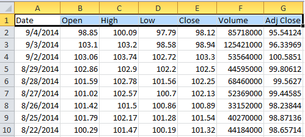
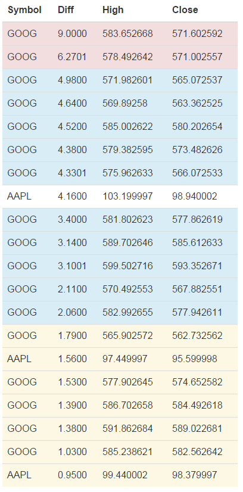

Stock Price Analysis 
----------------------


```csharp
//Stock symbols of companies for which you want to run this 
string[] symbols = { "AAPL", "GOOG", "MSFT" };
Dictionary<string, Table> stocks = new Dictionary<string, Table>();
string template = @"http://real-chart.finance.yahoo.com/table.csv?s=[Symbol]&d=8&e=4&f=2014&g=d&a=0&b=2&c=1962&ignore=.csv";
foreach (var symb in symbols)
{
    WebClient wc = new WebClient();
    wc.DownloadFile(template.Replace("[Symbol]", symb), "temp" + symb + ".csv");
    stocks.Add(symb, DataAcquisition.LoadCSV("temp" + symb + ".csv").Top(30));
}

//Creating the symbol column. 
symbols.ToList().ForEach(s => stocks[s].AddColumn("Symbol", new List<string>(Enumerable.Repeat(s, 30))));

//Merging the results using LINQ. 
Table allStocks = symbols.Select(ticker => stocks[ticker])
                         .Aggregate((first, second) => first.Merge(second));

//Adding the column "Diff" programmatically. 
allStocks.AddColumn(columnName: "Diff", formula: "[Open] - [Close]", decimalDigits: 4);

//Preparing to write the result in a HTML file.
StreamWriter sw = new StreamWriter("temp.htm");

Func<Dictionary<string, string>, bool> greatValues = x => Math.Abs(Convert.ToDecimal(x["High"])) >= 500;
Func<Dictionary<string, string>, bool> worries = x => Math.Abs(Convert.ToDecimal(x["Diff"])) >= 6;
Func<Dictionary<string, string>, bool> warnings = x => Math.Abs(Convert.ToDecimal(x["Diff"])) <= 2;
string htmlTable = allStocks
                     //Sort by the difference in descending order
                    .SortBy("Diff", how: SortDirection.Descending)
                     //Taking top 20 entries
                    .Top(20)
                    //Pick only these columns
                    .Pick("Symbol", "Diff", "High", "Close")
                    .ToBootstrapHTMLTableWithColoredRows
					(infoPredicate: greatValues,
                     warningPredicate: warnings,
                     dangerPredicate: worries);

sw.WriteLine(htmlTable);
sw.Close();
System.Diagnostics.Process.Start("temp.htm");
```

This produces the following output 

